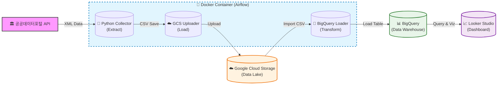

## Architecture Pipeline

```mermaid
graph LR
    %% 노드 정의
    API[🏛️ 공공데이터포털 API]
    
    subgraph Local_Docker ["🐳 Docker Container (Airflow)"]
        direction TB
        Collector[("🐍 Python Collector<br/>(Extract)")]
        GCS_Uploader[("☁️ GCS Uploader<br/>(Load)")]
        BQ_Loader[("💾 BigQuery Loader<br/>(Transform)")]
    end
    
    GCS[("☁️ Google Cloud Storage<br/>(Data Lake)")]
    BQ[("📊 BigQuery<br/>(Data Warehouse)")]
    Looker[("📈 Looker Studio<br/>(Dashboard)")]

    %% 흐름 연결
    API --> |XML Data| Collector
    Collector --> |CSV Save| GCS_Uploader
    GCS_Uploader --> |Upload| GCS
    GCS --> |Import CSV| BQ_Loader
    BQ_Loader --> |Load Table| BQ
    BQ --> |Query & Viz| Looker

    %% 스타일링
    style API fill:#f9f,stroke:#333,stroke-width:2px
    style Local_Docker fill:#e1f5fe,stroke:#0277bd,stroke-width:2px,stroke-dasharray: 5 5
    style GCS fill:#fff3e0,stroke:#ef6c00,stroke-width:2px
    style BQ fill:#e8f5e9,stroke:#2e7d32,stroke-width:2px
    style Looker fill:#f3e5f5,stroke:#7b1fa2,stroke-width:2px
```
